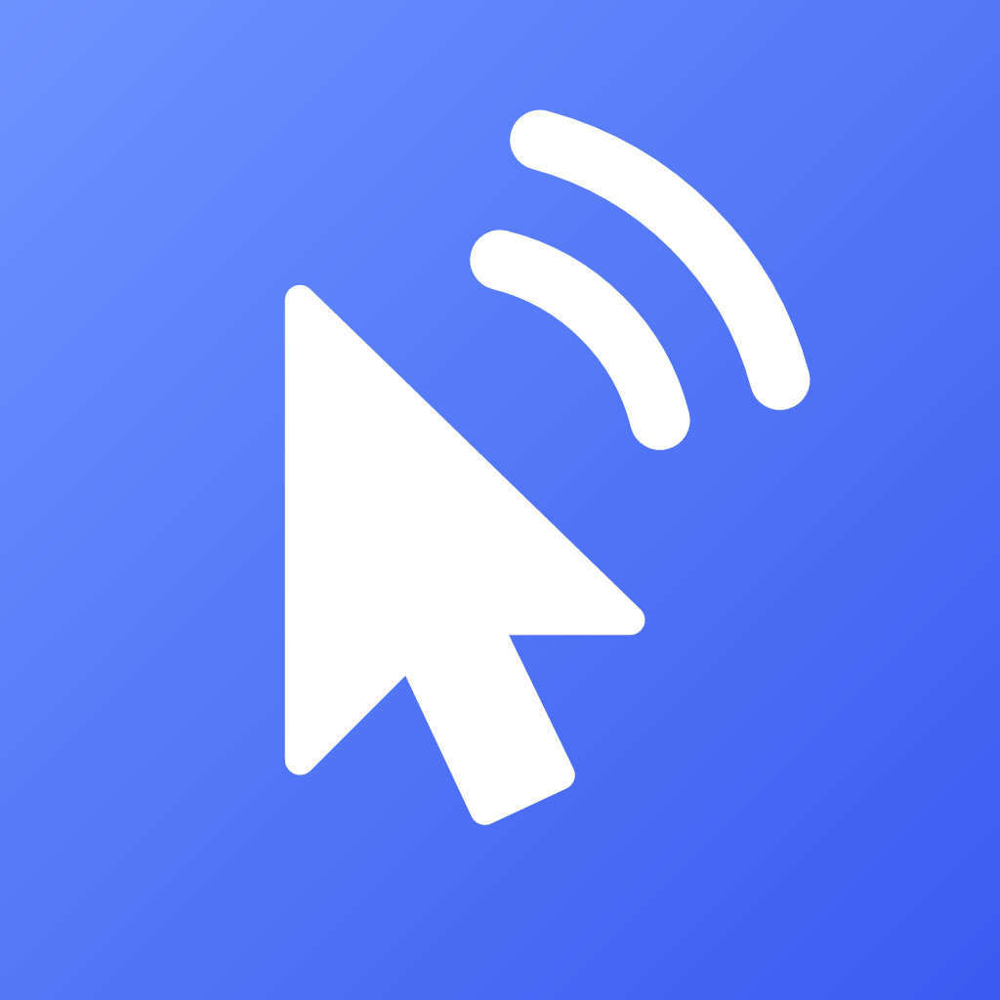

<p align="center">
  
</p>

<h1 align="center">Reach</h1>

Control your Windows PC from your phone (iPhone or Android): a trackpad, a keyboard, a
PowerShell terminal and one-tap saved commands.

**Free · Private · Local.** Reach works only on your home network. There are no accounts, no
cloud and no tracking; nothing leaves your devices.

## How it works

- **The PC** runs a small tray app, `Reach.exe`. It listens on your home network (TCP 47800)
  and moves the mouse, types, runs the terminal and runs your saved commands.
- **The phone** runs the Reach app. You pair it once by scanning a QR code the PC shows.
- **Only one phone at a time.** While a phone is connected, the PC shows which one and for how
  long, with a Disconnect button. A second phone is told the PC is busy.

## Security

- Every connection is encrypted and authenticated in both directions with the
  [Noise](https://noiseprotocol.org/) handshake `Noise_IK_25519_ChaChaPoly_SHA256`, the same
  pattern WireGuard uses. Both sides pass the official Noise test vectors.
- Pairing uses a random, single-use code in the QR code that expires after 2 minutes. The PC
  only accepts phones it has paired with.
- The phone asks for Face ID, a fingerprint or its screen lock before it connects. Its key is
  kept in the Keychain (iPhone) or Keystore (Android); the PC's key is protected with Windows
  DPAPI.
- The firewall rule Reach adds allows only **Private** networks. Failed handshakes are rate
  limited.
- Logs (`%APPDATA%\Reach\logs`, 7 days) record connections and errors, **never** what you type,
  terminal input or output, or keys.

The full design is in [`docs/superpowers/specs/2026-09-26-reach-design.md`](docs/superpowers/specs/2026-09-26-reach-design.md).

## Get started

### On the PC (Windows 10 or 11, x64)

1. Build `Reach.exe` (below) and run it. The Reach icon appears in the tray.
2. On first run, allow the firewall rule so your phone can connect.
3. Left-click the tray icon (or choose **Pair new phone…**) to show the pairing code.

### On the phone

See [`app/README.md`](app/README.md). In short: install **Expo Go**, run `npm start` in `app/`,
open Reach, unlock it and scan the PC's code from **Pair**.

### Saved commands

Choose **Edit commands** in the tray menu to edit `%APPDATA%\Reach\commands.json`. Reach
picks up changes as soon as you save.

## Build from source

Requirements: the [.NET 10 SDK](https://dotnet.microsoft.com/download) and a current Node.js LTS.

```powershell
# The PC app, as one self-contained Reach.exe (no .NET install needed to run it)
dotnet publish agent/Reach.Agent -c Release -r win-x64 --self-contained true `
  -p:PublishSingleFile=true -p:IncludeNativeLibrariesForSelfExtract=true `
  -p:EnableCompressionInSingleFile=true -p:DebugType=none -o dist

# Tests
dotnet test agent/Reach.slnx
npm ci --prefix protocol/ts; npm test --prefix protocol/ts
cd app; npm ci; npm test
```

## Repository layout

| Folder | What's in it |
|---|---|
| `agent/` | The Windows tray app (C#, .NET 10, WinForms and Kestrel), the protocol's C# side (`Reach.Protocol`) and their tests |
| `app/` | The phone app (Expo, React Native, TypeScript) |
| `protocol/` | The protocol's TypeScript side (Noise and the message types) and the cross-language test vectors both sides check |
| `docs/` | The design spec |

## License

Copyright 2026 Mohamed Abdulghany. Licensed under the [Apache License 2.0](LICENSE).

If you use or build on this code, keep the copyright notice and the [`NOTICE`](NOTICE) file
with it, as the license requires.
